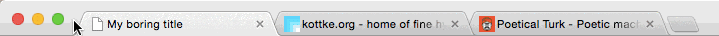

Favicon chameleon
==================

Makes your tab dissapear when nobody is paying attention.

### Demo 

[Try before you buy](http://javierarce.github.io/jquery.favicon.chameleon).




### Installation

1. Add the ```jquery.favicon.chameleon.js``` file to your HTML page.
2. Add the ```favicons``` folder.
2. Launch the plugin: 
```js
$(function() {
    $(this).faviconChameleon({
services: ["twitter", "gmail", "tumblr"]
});
    });
```

----

The jQuery plugin was created using the [jQuery Plugin Template](http://kolodny.github.io/blog/blog/2013/12/27/my-favorite-jquery-plugin-template/) by Moshe Kolodny.
